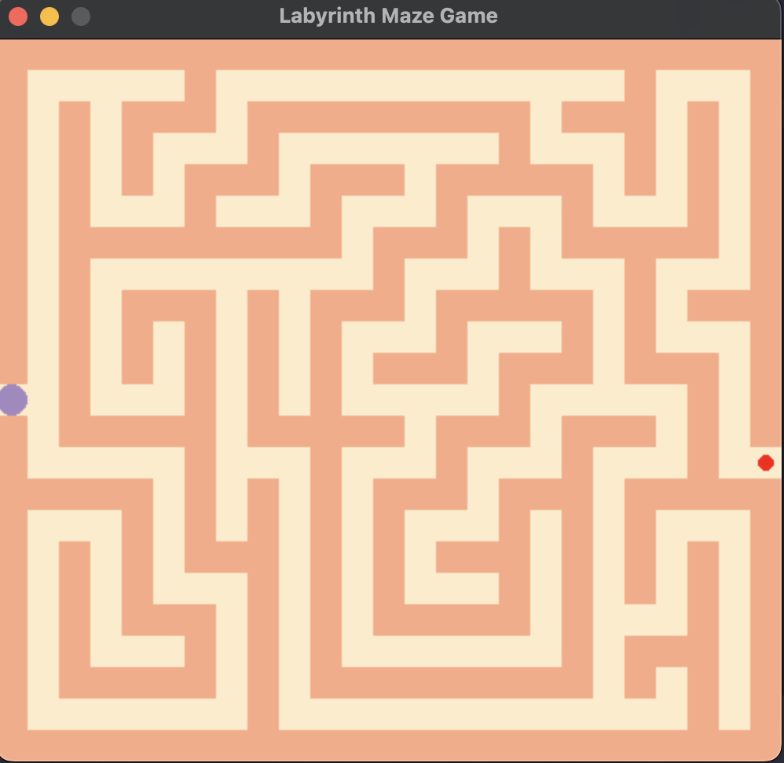

# Graficación utilizando Pygame

Este proyecto consiste en la creación de un entorno tipo laberinto utilizando la librería `pygame`. El objetivo es familiarizarse con la creación de entornos para la simulación de agentes inteligentes.

## Capturas de Pantalla

A continuación, se muestran algunas capturas de pantalla del entorno del laberinto creado:


_Descripción de la captura de pantalla 1._


_Descripción de la captura de pantalla 2._

## Características del Laberinto

...

- Ejecuta el siguiente comando para iniciar el laberinto:

   ```bash
   python graficacion-laberinto.py
